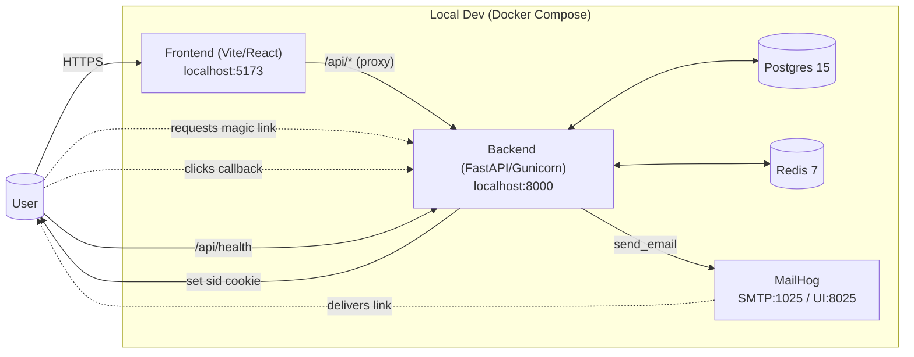
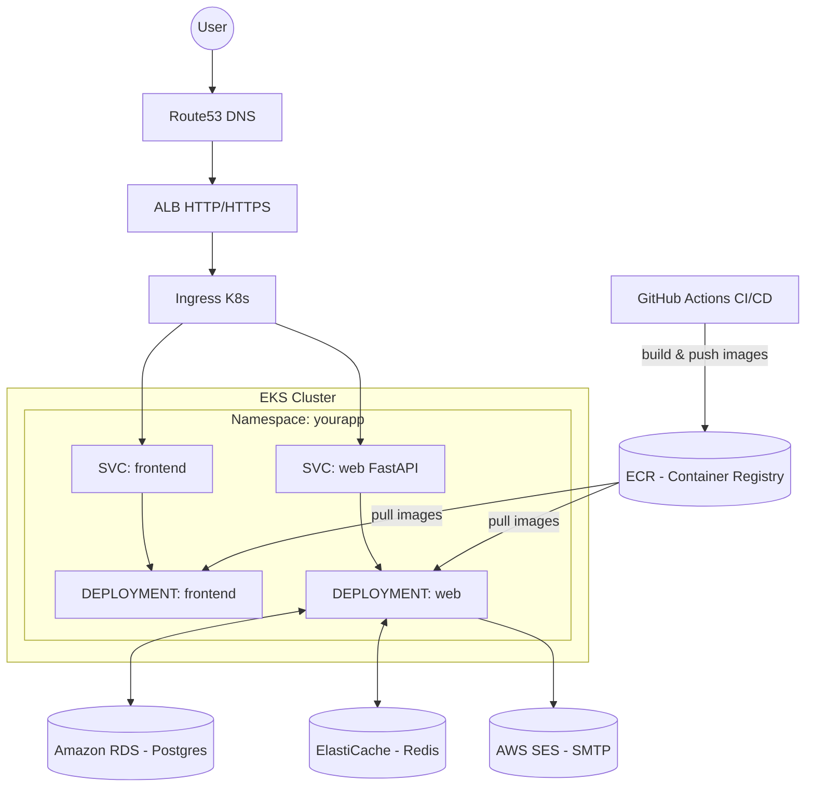

# 🐳 Windows Docker Setup

If Docker isn’t running or errors occur, use these steps:

1. **Start Docker Desktop service**
   ```powershell
   Start-Service com.docker.service -ErrorAction SilentlyContinue
   ```

2. **Launch Docker Desktop app**
   ```powershell
   & "C:\Program Files\Docker\Docker\Docker Desktop.exe"
   ```

3. **Verify daemon**
   ```powershell
   docker info
   docker version
   docker context ls
   ```
   Should show `desktop-linux` or `default`.

4. **Switch to Linux containers**
   - Right-click the Docker whale → *Switch to Linux containers…*

5. **WSL setup (if needed)**
   ```powershell
   wsl --install
   wsl --set-default-version 2
   wsl -l -v   # confirm distro is running (e.g. Ubuntu, VERSION 2)
   ```
   Enable distro in Docker Desktop → Settings → Resources → WSL Integration.

6. **Test images**
   ```powershell
   docker pull hello-world
   docker run --rm hello-world
   docker pull redis:7
   ```

---

# 🍎 Mac Docker Setup

1. Install **Docker Desktop for Mac** (Apple Silicon or Intel version).  
   👉 https://docs.docker.com/desktop/install/mac/

2. Start Docker Desktop from Applications.

3. Verify installation:
   ```sh
   docker info
   docker version
   ```

4. Run a test container:
   ```sh
   docker run --rm hello-world
   docker pull redis:7
   ```

---

# 🚀 Quickstart (Local Development)

### Backend (Flask + Redis + Postgres)
```sh
cd compose
docker compose --env-file .env.dev up --build
```

Reset and Rebuild
```sh
docker compose down -v
docker compose --env-file .env.dev up --build
```

Visit the backend health check:  
👉 http://localhost:5173/api/health

---

### 🧭 API Documentation (Swagger & ReDoc)

Once your backend container is running, **FastAPI** automatically provides interactive API documentation at these endpoints:

- **Swagger UI:**  
  👉 [http://localhost:8000/docs](http://localhost:8000/docs)

- **ReDoc:**  
  👉 [http://localhost:8000/redoc](http://localhost:8000/redoc)

These docs let you:
- Browse all backend routes (auth, CRUD, etc.)  
- View request/response models and example payloads  
- Try live API calls right from your browser using your running backend  

If you’re running via Docker Compose, ensure the `web` service is running and port **8000** is exposed.  
If deployed to AWS, you’ll find the same docs at:  
👉 `https://<your-domain>/api/docs` and `https://<your-domain>/api/redoc`

---

### Frontend (Vite + React + TypeScript)
```sh
cd frontend
npm install          # or npm ci
npm run dev          # starts Vite dev server
```

Visit the frontend app:  
👉 http://localhost:5173

> ⚡ If running inside Docker Compose, the `frontend` container also serves at `http://localhost:5173`.

Ensure `package.json` has the right scripts:
```json
"scripts": {
  "dev": "vite --host --port 5173",
  "build": "vite build",
  "preview": "vite preview",
  "test": "vitest",
  "test:ci": "vitest run --coverage"
}
```

---

# 🧪 Running Tests

## Backend (Flask + Pytest)

All backend tests should be run inside your virtual environment (`.venv`).

### 1. Activate the venv

**Windows (PowerShell):**
```powershell
.venv\Scripts\activate
```

**Mac/Linux (bash/zsh):**
```sh
source .venv/bin/activate
```
pip install -r app/requirements-dev.txt
### 2. Run unit tests with coverage (skipping integration tests)
```sh
pytest --cov=app --cov-report=term-missing -m "not integration"
```

- `--cov=app` → measures coverage on the backend app code  
- `--cov-report=term-missing` → shows which lines are untested  
- `-m "not integration"` → skips tests marked as `@pytest.mark.integration`  

### 3. Run **all tests** (including integration)
```sh
pytest --cov=app --cov-report=term-missing
```

---

## Frontend (Vite + Vitest)

Install dependencies if not already:
```sh
cd frontend
npm install
```

Run the test suite:

```sh
# normal test run
npm run test

# CI-style run with coverage
npm run test:ci
```

If coverage fails, install the plugin:
```sh
npm install -D @vitest/coverage-v8
```

---

## Database Access

Our stack runs Postgres inside Docker (`db` service in `docker-compose.yml`).

### Option 1: Command Line
You can connect using `psql`:

```bash
docker compose exec db psql -U postgres -d appdb
-U postgres → user

-d appdb → database

Once inside:

sql
Copy code
\dt             -- list tables
\d users        -- describe table "users"
SELECT * FROM users;
\q              -- quit

## Database Access (GUI Tools)

We use **PostgreSQL** for this project.  
Since **MySQL Workbench does not support Postgres**, use one of these GUI clients:

- [**DBeaver Community**](https://dbeaver.io/download/) (recommended, cross-platform, supports Postgres & many other DBs)
- [**pgAdmin 4**](https://www.pgadmin.org/download/) (official Postgres GUI)

### Connection Settings
Use these values (from `.env.dev` or `docker-compose.yml`):

- **Host:** `localhost`
- **Port:** `5432`
- **Database:** `appdb`
- **User:** `postgres`
- **Password:** `postgres`

### Setup in DBeaver
1. Install DBeaver Community Edition.
2. Open DBeaver → **Database > New Database Connection**.
3. Select **PostgreSQL**.
4. Enter the following:
   - Host: `localhost`
   - Port: `5432`
   - Database: `appdb`
   - Username: `postgres`
   - Password: `postgres`
5. Click **Test Connection** → if successful, click **Finish**.
6. Expand the new connection in the left sidebar to view schemas, tables, and run SQL queries.

### Setup in pgAdmin
1. Install [pgAdmin 4](https://www.pgadmin.org/download/).
2. Open pgAdmin and click **Add New Server**.
3. In the **General** tab, give it a name like `Local App DB`.
4. In the **Connection** tab, enter:
   - Host: `localhost`
   - Port: `5432`
   - Username: `postgres`
   - Password: `postgres`
5. Save → you should now see the database tree in pgAdmin.

---

⚡ With either tool, you can:
- Inspect tables and schema migrations
- Run SQL queries directly
- Export/import data
- Monitor active connections


# ☁️ Build & Push to AWS ECR

Both **backend** and **frontend** images can be built and pushed:

```sh
# backend
docker build -f docker/web.Dockerfile -t $AWS_ACCOUNT_ID.dkr.ecr.$AWS_REGION.amazonaws.com/yourapp-web:dev .
docker push $AWS_ACCOUNT_ID.dkr.ecr.$AWS_REGION.amazonaws.com/yourapp-web:dev

# frontend
docker build -f docker/frontend.dev.Dockerfile -t $AWS_ACCOUNT_ID.dkr.ecr.$AWS_REGION.amazonaws.com/yourapp-frontend:dev .
docker push $AWS_ACCOUNT_ID.dkr.ecr.$AWS_REGION.amazonaws.com/yourapp-frontend:dev
```

Or use `make` targets if defined:
```sh
make docker-build docker-push
```

---

# 🚢 Deploy to AWS EKS

After EKS and IAM are set up:

```sh
kubectl apply -k k8s/overlays/dev
```

This applies both `web` and `frontend` Deployments/Services/Ingress.

- Backend is exposed at `/api/*`
- Frontend is served at `/` through the ALB Ingress

---

# 🔄 GitHub Actions CI/CD

In **GitHub → Settings → Secrets and variables**:

### Variables
- `AWS_REGION`
- `AWS_ACCOUNT_ID`
- `ECR_REPOSITORY_WEB` (e.g., `yourapp-web`)
- `ECR_REPOSITORY_FRONTEND` (e.g., `yourapp-frontend`)
- `EKS_CLUSTER_NAME`
- `K8S_NAMESPACE` (e.g., `yourapp`)

### Secrets
- `AWS_ROLE_TO_ASSUME` (IAM role with OIDC trust)

The CI/CD workflow will:
- Build Docker images for **web** and **frontend**
- Push to ECR
- Patch the Kubernetes manifests (`REPLACEME_ECR_URI` placeholders)
- Deploy via `kubectl apply -k k8s/overlays/dev`

# System Architecture Diagrams

Below are two Mermaid diagrams that describe the architecture of the project in **Local (Docker Compose)** and **AWS (EKS)** environments.

---

## 1) Local Development — Docker Compose



**Notes**
- Frontend uses Vite dev server in development (or an Nginx-based container in production).
- Frontend proxies `/api/*` to backend (`web:8000`).
- Backend uses SQLAlchemy → Postgres, Redis for sessions, Mailhog as local SMTP.
- Auth flow: request-link → email → callback → set secure `sid` cookie in browser.

---

## 2) Cloud — AWS EKS (Production)



**Notes**
- Download mermaid extension on VS code to edit diagram
- ALB terminates TLS (ACM certificate) and routes traffic to the Kubernetes Ingress.
- Ingress routes `/` to `frontend` service and `/api/*` to `web` service.
- Backend talks to RDS (Postgres) and ElastiCache (Redis). Emails via SES.
- CI/CD: GitHub Actions builds/pushes to ECR and deploys to EKS.

---

## Legend

- **FE** = Frontend (React + Vite).  
- **BE** = Backend (FastAPI with Gunicorn/Uvicorn).  
- **Redis** stores sessions (`sid`).  
- **Postgres** stores app data (users, etc.).  
- **Mailhog / SES** handles outgoing emails (magic link).  
- **ALB + ACM** terminate TLS in AWS; Ingress routes to services.

